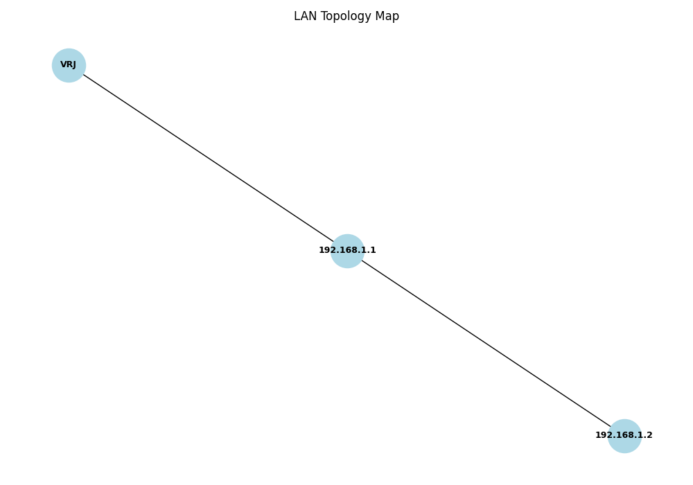

# 📡 CableNetMonitor

<div align="center">


**A powerful Python-based CLI tool to monitor and visualize your local network in real-time**

*Monitor device uptime • Track network latency • Generate beautiful topology maps*

[Features](#-features) • [Installation](#-installation) • [Usage](#-usage) • [Screenshots](#-screenshots) • [Contributing](#-contributing)

</div>

---

## 🌟 Overview

CableNetMonitor is an intuitive network monitoring solution that provides comprehensive insights into your local area network. It continuously pings devices within your specified IP range, logs their connectivity status, and generates beautiful visual topology maps labeled with device hostnames.

### ✨ Key Highlights

- **Real-time Monitoring**: Track device availability and network performance
- **Visual Network Maps**: Generate topology diagrams with hostname labels
- **Comprehensive Logging**: Export data to CSV for analysis
- **Flexible Scheduling**: One-time scans or continuous monitoring
- **Cross-platform**: Works on Windows, Linux, and macOS

---

## 🚀 Features

| Feature | Description |
|---------|-------------|
| 🎯 **Smart IP Scanning** | Ping devices in custom IP ranges with configurable intervals |
| 📊 **Detailed Logging** | Track IP, latency, hostname, MAC address, and timestamps |
| 🕐 **Automated Scheduling** | Set up recurring scans every X minutes or run one-time scans |
| 🗺️ **Network Visualization** | Generate beautiful topology graphs with device relationships |
| 🏷️ **Hostname Labels** | Automatically resolve and display device hostnames |
| 🎨 **Colored Terminal** | Intuitive color-coded output (🟢 UP / 🔴 DOWN) |
| 📱 **User-friendly CLI** | Emoji-based interface designed for beginners |

---

## 📦 Installation

### Prerequisites

- Python 3.7 or higher
- pip package manager

### Quick Install

1. **Clone the repository**
   ```bash
   git clone https://github.com/vishnuvrj7/CableNetMonitor.git
   cd CableNetMonitor
   ```

2. **Install dependencies**
   ```bash
   pip install -r requirements.txt
   ```

### Required Dependencies

```txt
ping3>=4.0.0
networkx>=2.8
matplotlib>=3.5.0
colorama>=0.4.4
```

---

## 🛠️ Usage

### Quick Start

1. **Run the application**
   ```bash
   python main.py
   ```

2. **Configure your scan**
   - **Start IP**: Enter the beginning of your IP range (e.g., `192.168.1.1`)
   - **End IP**: Enter the end of your IP range (e.g., `192.168.1.50`)
   - **Scan Interval**: 
     - Enter `0` for a one-time scan
     - Enter any number `> 0` for continuous monitoring (in minutes)

### Example Configuration

```
🌐 CableNetMonitor - Network Scanner
━━━━━━━━━━━━━━━━━━━━━━━━━━━━━━━━━━━━━━━━━━

📍 Start IP: 192.168.1.1
📍 End IP: 192.168.1.50
⏱️  Scan Interval: 5

🚀 Starting network scan...
```

---

## 📁 Project Structure

```
CableNetMonitor/
├── 📄 main.py              # CLI entry point and user interface
├── 🌐 pinger.py            # Core ping functionality
├── 🔍 scanner.py           # IP range generation and scanning logic
├── 📝 logger.py            # CSV logging and data persistence
├── 🎨 visualizer.py        # Network topology visualization
├── 📊 ping_log.csv         # Generated log file
├── 🖼️ topology.png         # Generated network diagram
├── 📋 requirements.txt     # Python dependencies
└── 📖 README.md           # Project documentation
```

---

## 📈 Output Files

### 📊 Log File: `ping_log.csv`

The tool generates a comprehensive CSV log with the following columns:

| Column | Description | Example |
|--------|-------------|---------|
| `Timestamp` | When the ping was performed | `2025-07-24 01:03:20` |
| `IP` | Target IP address | `192.168.1.8` |
| `Status` | Device availability | `UP` / `DOWN` |
| `Latency` | Response time in ms | `1.28` |
| `Hostname` | Resolved device name | `desktop-hp` |
| `MAC Address` | Physical address | `d8:50:e6:12:3a:9c` |

### 🗺️ Network Topology: `topology.png`

- Visual representation of your network structure
- Devices connected to gateway/router
- Hostname labels for easy identification
- Color-coded status indicators

---

## 📸 Screenshots

<div align="center">

### Network Topology Visualization


*Example network topology showing connected devices with hostnames*

### Terminal Output
```
🟢 192.168.1.1    UP     2.1ms   router.local
🟢 192.168.1.8    UP     1.3ms   desktop-hp
🔴 192.168.1.15   DOWN   ---     unknown
🟢 192.168.1.22   UP     0.8ms   laptop-work
```

</div>

---

## 🔮 Roadmap & Future Ideas

- [ ] **📱 Web Dashboard**: Flask/Streamlit-based web interface
- [ ] **🚨 Smart Alerts**: Notifications when devices go offline
- [ ] **💾 Database Support**: SQLite and JSON export options
- [ ] **🌐 Subnet Scanning**: Full subnet discovery (192.168.1.0/24)
- [ ] **🔍 Device Intelligence**: Automatic device type/vendor detection from MAC
- [ ] **📊 Historical Analytics**: Long-term network performance trends
- [ ] **⚡ Performance Optimization**: Multi-threaded scanning
- [ ] **🔒 Security Features**: Port scanning and vulnerability detection

---

## 📄 License

This project is licensed under the MIT License - see the [LICENSE](LICENSE) file for details.

---


<div align="center">

**If you find this project helpful, please consider giving it a ⭐!**

[](https://github.com/vishnuvrj7/CableNetMonitor/stargazers)
[](https://github.com/vishnuvrj7/CableNetMonitor/network)


</div>